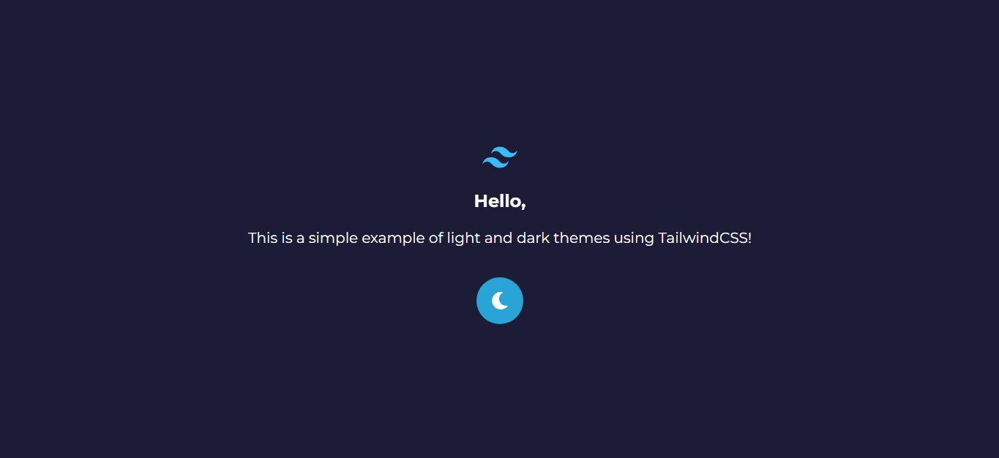
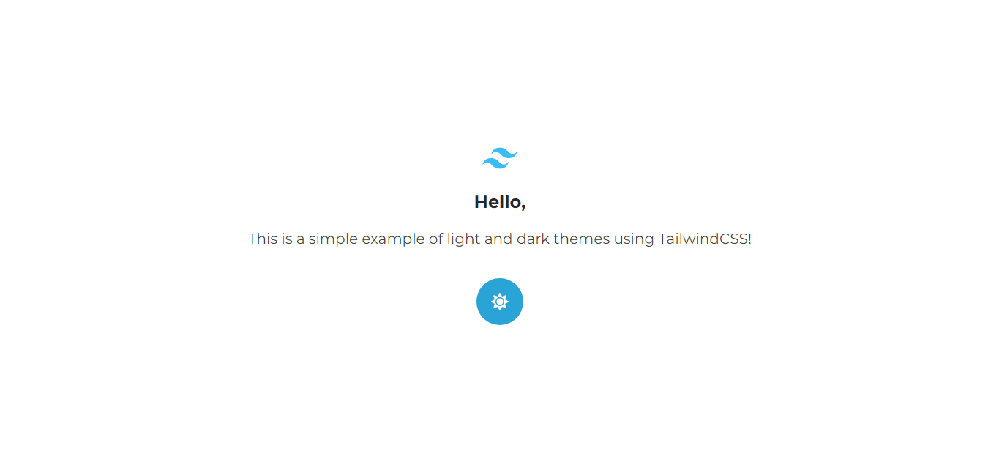

# About

This is a responsive website made with ReactJS and TailwindCSS.

The objective of the project was to learn how to create different themes and toggle between them using Tailwind.

# Images




# Run it in your device

```bash

git clone https://github.com/arthur-lage/dark-mode-with-tailwindcss.git

cd dark-mode-with-tailwindcss

npm install

# enter your favorite browser and go to http://localhost:3000

```

# Technologies Used

These were the technologies used in the project:

- HTML
- TailwindCSS
- JavaScript
- ReactJS
- Typescript

# Use the website

If you want to try this project, please click the link below:

[Click here to visit TailwindCSS Dark Mode](https://tailwind-dark-mode-al.vercel.app)
